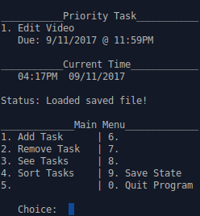

# D34DL1N3

Task priority in command line interface.



### Basic Use Cycle

1. Add tasks with a hard due date.
2. Remove tasks when completed.
3. Look at the item at the top of your to-do list and get to work. Progress on any item is good time spent.

### Install (linux command line)

1. clone repo, go to the directory
2. run ````make install```` to build and set up the program on your linux machine
	* you will be prompted for admin rights to finalize the install
3. execute the program by entering the command ````dtpriority```` in your terminal

````make help```` shows other options available on the makefile

## The D34DL1N3 Project

1. The goal is to build a user-friendly lightweight program that will allow a user to feed in all sorts Deadlines - Tasks, homework, or anything - and have a list of things to do that is automatically prioritized based on Due Date.

### Dev Todo List, Ideas, future updates, etc

1. Additional Useful Functions that could be added
    1. Add Task Breakdown Feature (idea mainly credited to @ebitikofer) (not implemented yet)
	    * creates subtasks with default names (section/chapter/anything)
	    * user determines subtask size
		    * even divides or custom
	    * resplit based on what is left at any point
	    * great for **big** tasks due way in the future
	2. Add Autosave at certain time intervals
	    * separate file that is used upon load if it is newer than the manual save file
	3. Add command line options that don't fully run the program
	    * option to add/remove tasks
	    * option to revise tasks
	        * these first 2 do the thing then save the file, and give the end user a success or failure message
	    * option to see Top Tasks (or any or all)
	4. Repeating Yearly, Monthly, Weekly, <specified day count> tasks can be set up to permantly repeat until removed. 
		* this allows for users to keep their whole life on specific routines and never forget to renew that yearly or monthly thing that must be upkept. I can see this being used as bill reminders, meeting reminders for groups, really the sky is the limit. The key thing here is that in any case, it remains super simple and straightforward and you just work on the thing at the top of the list in any case.
	5. Clean Feature 
		* prompts to all remove out of date tasks one by one or all at once 

2. Interface Clarity
	* Clean up / make clearer
	* Live Clock Ticker - sort of works, updates anytime the program changes
	* Build Terminal Graphic Library (scrapped, using cli) 
	* Show Time Left on a task
