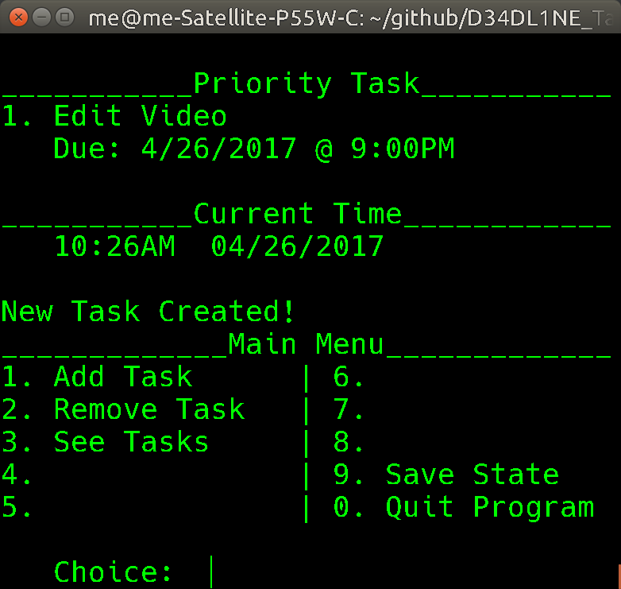

# D34DLINE Task Priority



_A prioritization program for the unorganized_

### The Project

1. Build a user-friendly UI and system in a lightweight program that will allow a user to:
	* Feed in tasks, homework, or anything a hard "Deadline" date.
	* Based on this data, the program will display the most urgent task that needs completed

### Basic Idea and Use

_This program will show at the top the next task that is due, the one you **should** be working on_

1. Add tasks along with their hard due date
2. Remove them when they are complete

### Install (linux command line)

1. ````git clone https://github.com/bytePro17124/D34DL1NE_Task_Priority/````
2. ````cd D34DL1NE_Task_Priority````
3. ````make````
4. ````make install```` (run this with sudo if permission is denied)

You can now run the program from your terminal using ````dtpriority````

### Uninstall (2 options from the same makefile used to install)

* ````make uninstall```` removes the program
* ````make purge```` removes the program and all saved data

### ToDo List / Idea List (in no particular order) (revise frequently)

1. Additional Useful Functions
    * Task Breakdown Feature (idea mainly credited to @ebitikofer) (not implemented yet)
	    * creates subtasks with default name section/chapter/whatever
	    * user determines subtask size
		    * even divides or custom
	    * resplit based on what is left at any point
	    * great for big tasks due way in the future

2. Working Conept
	* Terminal Version in the works (working, prealpha)
	* Build a flowchart structure.
	* Load/Save Tasks from file (working, prealpha)
	* Add/Remove Tasks features (working, prealpha)
	* Clean Feature
	* Proper Date Comparison Checks (working, prealpha)
	* Logs & Reports
	* Make the program Installable on Linux

3. Interface Clarity
	* Clean up / make clearer
	* Live Clock Ticker
	* Build Terminal Graphic Library (@ebitikofer)
	* Show Time Left
